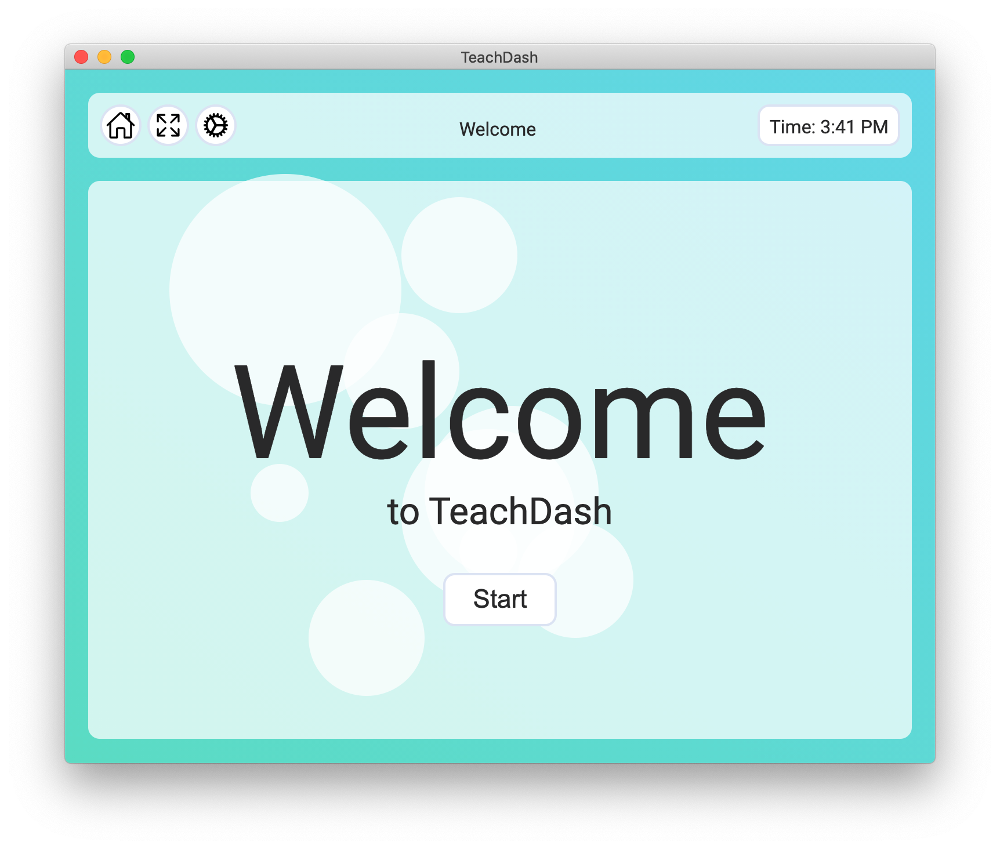
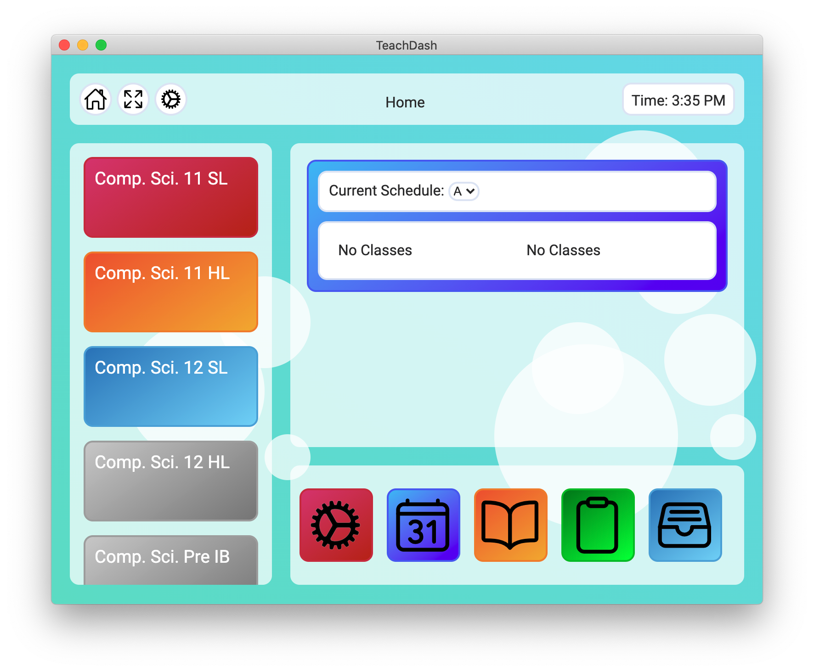
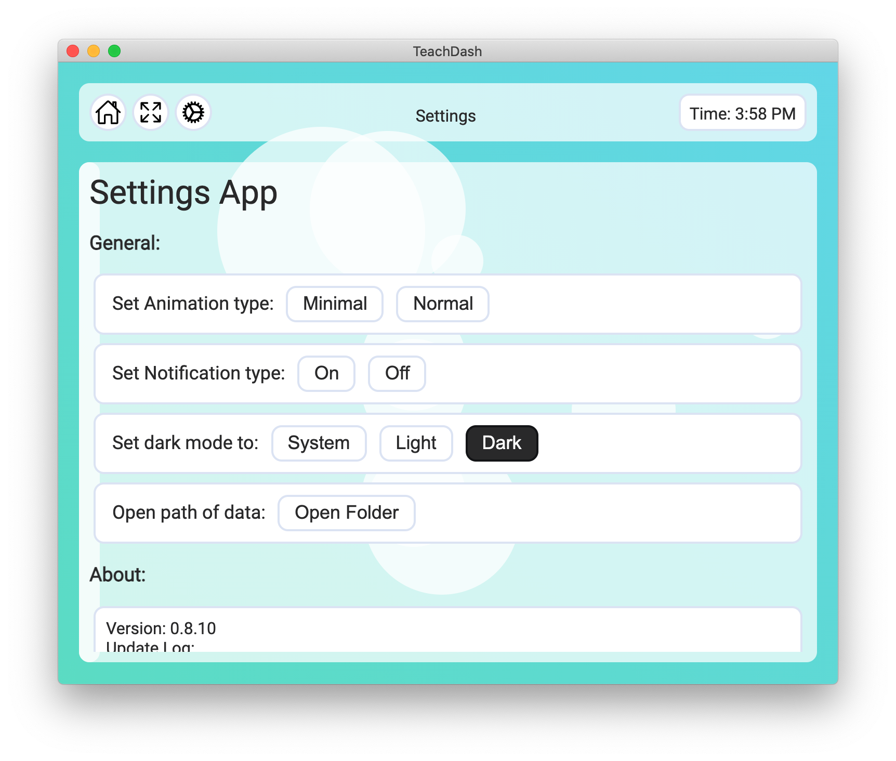
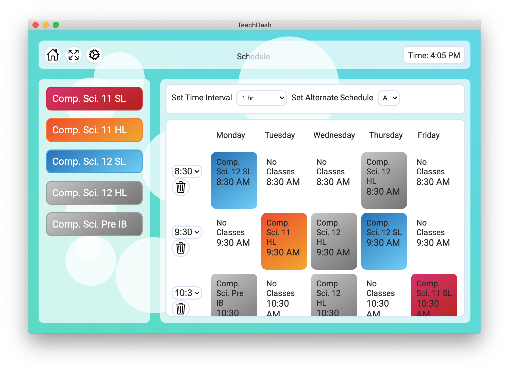
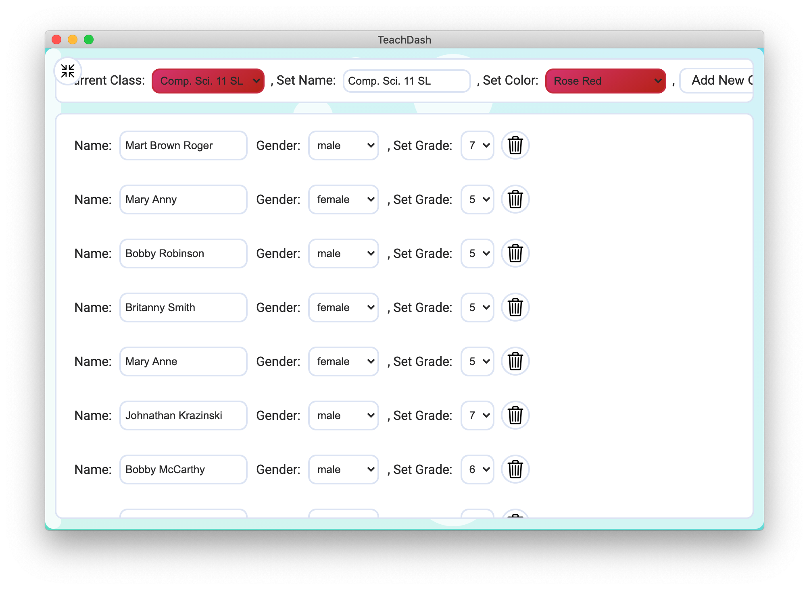
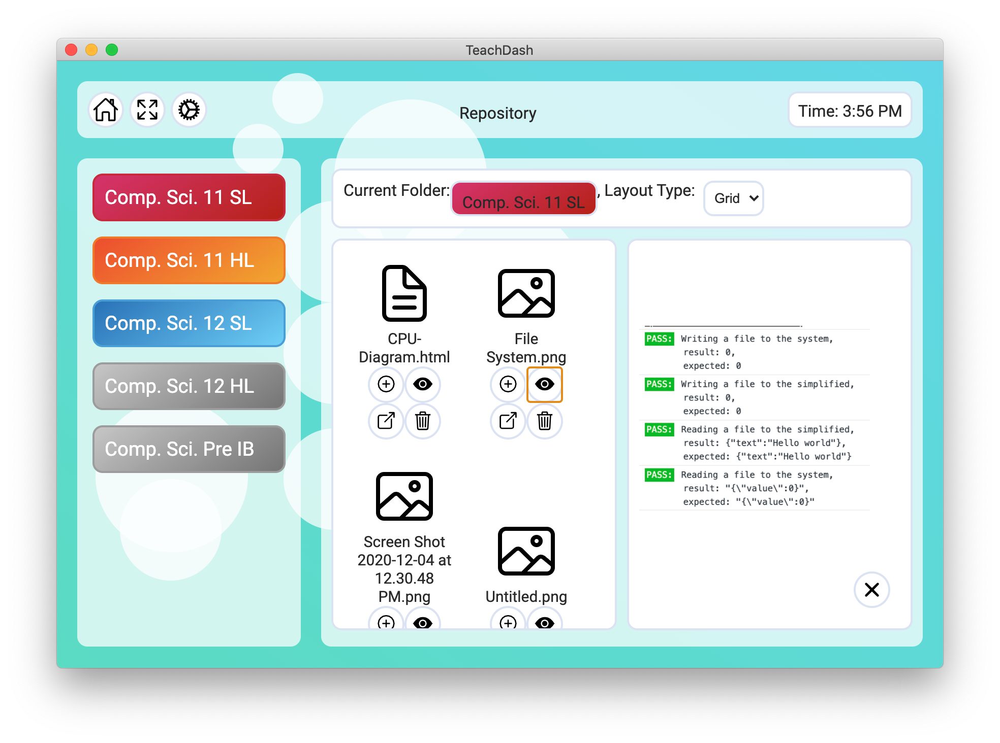
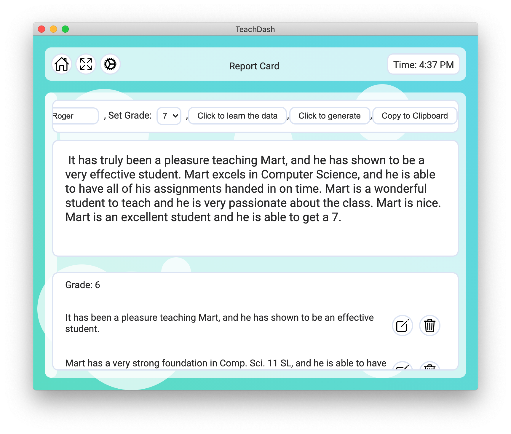
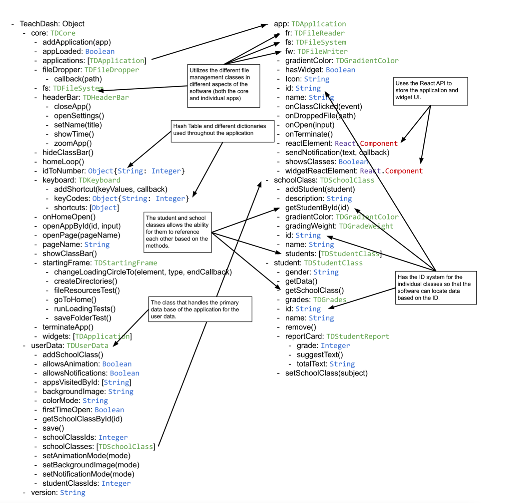

# TeachDash:

This project is my IB (International Baccalaureate) Computer Science Internal Assessment for my senior year of high school in 2022. I wrote the documentation and code over the span of 1 year while communicating with a client to create an organizing application to manage school content.



## How to setup:

### Basic Usage:

Begin by launching the terminal and moving the path to this folder. Make sure that you have [Node JS](https://nodejs.org/en) installed.

If you would like to use this project you need to download the packages with `npm install` and then you can launch the app with the command `npm run start`.

### Generating An App:

If you want to package the application yourself to have it run on your OS you can run the following command.

```
npm run make
```

The command will generate a packaged executable with all the code from this app.

*WARNING: This has been tested multiple times on macOS but hasn't been tested on windows so there might be inconsistencies*

## What is the IB CS IA:

The International Baccalaureate Computer Science Internal Assessments is an assignment where you find a client and create a software for them. You spend the next couple months communicating with the client and iterating on the software that you are making (better known as the product).

### Parts:

This Internal Assessment contains 5 parts:

- A: Introduction to the general project with explanation and plans of the project and clientelle communication.
- B: A document with the pre planning of how the software is being made including UML diagrams, GUI prototypes, and other templates to structure the software.
  - *NOTE: Crit_B_Record_of_tasks.pdf shows the timeline of the entire project.*
- C: This document that describes all the different software techniques and other code explanation of the software that was made.
- D: A video outlining the different features of the software (not included in this repository due to the size of the project).
- E: The last section is an evaluation part including both the original client and the developer and assess the application.

## Features:

The application named TeachDash is a cross platform desktop application (macOS, Windows and linux) used to manage, create and organize a classroom. This would be a tool used for teachers to manage class materials and write report cards for students. 

### Layout:

The application is in a simple operating system like layout where there are multiple applications that act as different pages for different features of the application. There are also short cuts to the applications on some of the "School Classes" on the left navigation side.



### Applications:

This product or application has 5 core functional pages (or sub applications) to manage the user data. Most of these are react elements with separate containers.

*NOTE: if you would like to see more information I left the documents available in the `Documentation` folder.*

#### Settings:

The settings page has basic functionality generally for UI (dark mode, animations, etc), access to the data directory, and general information regarding the application.



#### Schedule:

The schedule page allows the user to drag and drop different classes and create 3 different weekly schedules. It also allows the user to be notified at the times of their next class when being used.

*WARNING: The notification hasn't been fully tested and might have problems on different operating systems.*



#### Class Organizer:

This section of the application allows the user to add modify and rename different students and organize their grades. The user can also add new class and students or rename them. They can also customize the coloring of the school class.



*NOTE: this screenshot below uses the full screen feature, that's why the rest of the UI is missing (you can exit full screen by putting your cursor in the top left, the button exits when the cursor is not in the top right corner).*

#### Report Cards:

The report card section allows the teacher to write report cards or generate them. You can access all the students and databases of different sentences to create text.

#### File Manager:

The file manager page has all the different user user school classes where you can drag and drop, preview, externally open, delete and edit files. The primary formats are text files (including coding file formats) and images files. Here's a screenshot of the page:



### Report Cards:

The report card section had a simplified text generation to create report cards automatically and then learn from the user data. All of this functions through a simple string replacement and recognized different pronouns, and names to be able to generate new report cards. The user could also modify the data base and add or remove any sentences the user would find redundant or not helpful. When the user generates a report the text will adapt to the name, grade and gender of the student.



## Code Explanation:

The primary part of the applicaiton is stored in the object `TDCore` class that communicates with other classes. The `TDCore` class has access to user data through the `TDUserData` class, and applications through the `TDApplication` class.

Here's a diagram of all the core classes (this is taken from Part C of the IA):



### Applications System:

The pages that are used through out the application that are stored on the `TDCore` object with all the different features. The applications also have access to the header bar (managed in the `TDHeaderBar` class) and file system (in the `TDFileSystem` class).

#### Adding Pages:

To create a page in the application, you would need to create a new class that inherits the properties and methods of `TDApplication` with the example below:

```javascript
/**
 * @class NewTDAppPage - a default new class
 */
function NewTDAppPage() {
  
  // this inherits all the properties and method from TDApplication
  TDApplication.call(this);
  
  // The ionicon image for the app icon 
  // NOTE: The available icons are precompiled in the file so to add new ones you would have to modify the file `./Code/src/System/GUI/Components/tdr-ionicon.js`
  this.icon = "book-outline";
  
  // The gradient color that is given for the application icon
  this.gradientColor = TDGradientColor.orange;
  
  // The id of the application
  this.id = "new-page-app-id";
  
  // The name of the application
  this.name = "Class Editor";
  
  // The element for the application that has a default app data
  // IMPORTANT: The property below contains the react element for the page
  this.reactElement = TDRNewTDAppPageContainer;
  
  // The function that saves the data
  this.save = function(){
    
    // writes to the simplified data
    TeachDash.userData.save();
    
  };
  
  // A callback function that is called whenever the application is opened
  this.onOpen = function(input){
    
    // run code
    
  };
  
  // you can add new properties and methods
  
}

// adds the new application to the TDCore class of the application
TeachDash.core.addApplication(new NewTDAppPage());
```

#### Memory Management:

To manage memory in the application, all pages had empty components and full components where the application would swap out the UI based on what the user is doing. This is why they are separate containers throughout the application so UI can be quickly and efficiently allocated in memory.

### Student and Class Data:

To manage school classes and students, there are classes called `TDSchoolClass` and `TDStudentClass`. Both of these classes had different properties and methods that allowed the data to be changed.

Here is a brief explanation of the core school classes:

- `TDStudentClass`: This is the class that contains general information on the students in the class.
- `TDSchoolClass`: This is the class that contains the main information on a school class with general information.
- `TDStudentReport`: This is the class that contains information about the way a student should be presented on a report card.

### File System and External Classes:

The application uses a handfull of classes to manage all the data in a simplified way using the NodeJS API.

- `TDFileSystem`: This is a class that has all the core file or directory methods
- `TDFileReader`: This is a simplified version of the class FileReader to make it simpler to get file information
- `TDFileWriter`: This is a class similar to the TDFileReader class but for writing
- `TDFSSimplifed`: This is a class that makes loading and saving JSON data incredibly simplified without having to look through the file or knowing where it is.

Example for `TDFSSimplifed`:
```javascript
// creates a file in the App Data directory (C:\Users\<username>\AppData\TeachDash\FSSimplified for windows, or /Users/<username>/Library/App Support/TeachDash/FSSimplified on macOS)
var fss = new TDFSSimplified("test-data");

// saves the object `{"test":true}`
fss.save({
  "test": true
});

// loads the object from the file (if empty it returns {})
fss.load(function(data){
  
  // prints the data
  console.log(data);
  
});
```

Example for `TDFileReader` and `TDFileWriter`:
```javascript
// gets the path for a new file called test.txt
var path = __dirname + "/test.txt";

// creates the file writer class
var writer = new TDFileWriter();

// writes the text file from the path with hello world
writer.text(path, "Hello world!");

// creates the file reader class
var reader = new TDFileReader();

// reads the text file from the path that we gave it
reader.text(path, function(text){
  
  // prints "Hello world!" (because it's the contents of the file)
  console.log(text);
  
});
```

## Sources:

Here are all the frameworks, and libraries used to create this project:

- [Node JS](https://nodejs.org/en): The core developer tools of this application.
- [ElectronJS](https://www.electronjs.org/): Foundation of the application.
- [Electron Forge](https://www.electronforge.io/): Secondary development layer for Electron.
- [Babel](https://babeljs.io/): open source compiler that allows JSX to be transpiled into javascript which was used for the user interface.
- [React JS](https://react.dev/): the front-end object oriented web framework developed at FaceBook used for building the user interfaces in the application.
- [Less CSS](https://lesscss.org/): post processing style sheet language to style the application.
- [Ionicons](https://ionic.io/ionicons): The icons used in the application thanks to ionic.
- [Google Fonts](https://fonts.google.com/): Took the Roboto font for the application.
